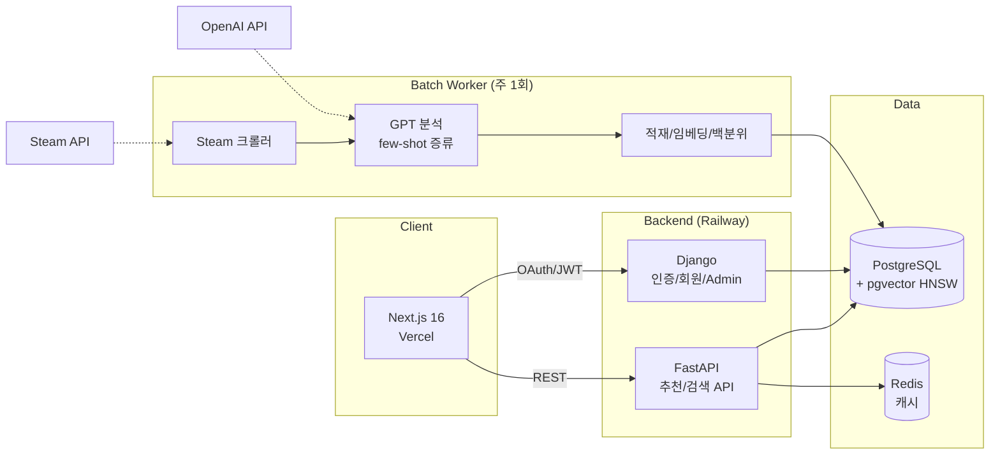

# Hidden Gem

Steam 게임 12,843개를 60개 지표로 정량화하고, 취향으로 게임을 찾고 숨은 명작을 발굴하는 서비스.

**Live**: [hidden-gem-gold.vercel.app](https://hidden-gem-gold.vercel.app) · **API**: FastAPI + Django (Railway) · **Web**: Next.js (Vercel)

<!-- docs/images/main.png : 메인 페이지 스크린샷 -->

## 개요

Steam에는 매년 1만 개 이상의 게임이 출시되지만, 발견은 인기 순위에 편중되고
장르 태그는 "이 게임이 왜 좋았는지"를 설명하지 못한다. Hidden Gem은 게임을
분위기·조작 요구도·메커니즘 같은 경험 단위의 지표로 분해해, 취향으로 게임을
찾을 수 있게 만든 프로젝트다.

- 게임당 60개 지표: 수치 49개(7개 그룹) + 불리언 태그 9개 + 신뢰도. 발굴 지수는 LLM 추정이 아닌
  **Steam 리뷰 실측**(Wilson 하한 × 무명도)
- 자연어 검색("혼자 조용히 즐기는 전략 게임"), 지표 슬라이더, 카드 스와이프의
  세 가지 취향 입력 방식 + 랭킹 3종(스테디 히든젬 / 요즘 뜨는 / 신작 리그)
- 신작·정착·유명 게임을 한 척도에 놓지 않는다: 취향 일치는 같은 척도, 발굴·랭킹은 생애주기별로 다른 질문
- 신작은 매주 자동 수집·분석·리뷰 갱신되어 데이터셋이 계속 성장 (교사 4,190 + 학생 8,653)

기획부터 데이터 구축, 백엔드/프론트엔드, 배포, 운영까지 1인 개발.

## 아키텍처



역할 분리: FastAPI는 추천·검색 읽기 경로(SQLAlchemy async), Django는
인증·회원·데이터 관리(ORM/Admin)를 담당한다. 두 프레임워크가 같은 PostgreSQL을
공유하며, 스키마 정본은 SQLAlchemy 모델로 고정해 이중 ORM의 드리프트를 막았다.

## 데이터: 교사-학생 증류 파이프라인

핵심 비용 문제 — 상위 모델로 전체를 분석하면 정확하지만 비싸고, 경량 모델은
싸지만 점수가 뭉개진다. 이를 지식 증류로 풀었다.

**교사 데이터 (1회 구축)**
- GPT-5.4 Batch API로 4,190개 게임 분석 (Batch 채택으로 동기 대비 비용 50% 절감)
- 블라인드 입력: 모델에는 `app_id, name, genres, description` 4개 필드만 제공.
  개발사·평점을 의도적으로 숨겨 인지도 편향을 차단

**학생 데이터 (8,653개, 2026-03~ 출시작 전수 백필 + 매주)**
- gpt-5.4-mini + 12-shot 증류로 교사와 동일한 스키마 유지. 실측 단가 요청당 $0.0049
  (Batch 50% × 프롬프트 캐시 90% 중복 적용, 대시보드 검증), 8,653건 $43
- 홀드아웃 150쌍(교사 게임을 학생이 재분석) — 49 수치 지표 평균 MAE 0.77 로 교사급.
  LLM 이 추정한 발굴 가능성(gem)은 교사와 상관이 없어(r≈0) **리뷰 실측 지수로 대체**
- few-shot 예시는 gem 점수 구간별 층화 추출: 명작만 예시로 주면 신작 점수가
  일괄 상향/하향되는 캘리브레이션 붕괴가 실측으로 확인되어, 하/중/상 구간과
  장르 다양성을 강제했다
- 품질 게이트: 적재 전 파싱률·스키마 완전성·gem 분포·confidence 분산을 검증.
  개별 출력이 그럴듯해도 집단 분포가 교사와 어긋나면 적재를 차단

**주간 자동화** (`embeddings/weekly_pipeline.py`)

```
space(볼륨 70% 게이트) → crawl(신작 발견, DB 중복 제외) → batch(few-shot 분석) → load(UPSERT)
  → embed(임베딩) → reviews(Steam 리뷰 수 + 노출 게이트) → percentile → recheck(비활성 30일 재평가)
  → history(활성 게임 주간 리뷰 이력 → '요즘 뜨는' 재료) → gem(발굴 지수 재계산)
```
대상 DB 는 **운영**(Railway Postgres). 로컬 DB 는 개발 미러이고, 로컬→운영 이동은 `embeddings/prod_sync.py`(upsert, 삭제 없음)만 쓴다.

- 노출 게이트: 분석·임베딩은 전수로 수행하되, 서비스 노출(`is_active`)은
  리뷰 수가 기준(기본 10, Steam이 리뷰 점수를 표시하는 최소치) 이상인 게임만.
  기존 데이터가 인기순 샘플이었던 것과 달리 신작은 출시작 전수라 리뷰 0개
  무명작이 그대로 들어오기 때문. 데이터는 지우지 않고 리뷰가 붙으면 재활성화
  (`embeddings/exposure_policy.py`, `refresh_reviews.py`)
- 학생 모델 감사: 교사 데이터 게임을 층화 샘플해 학생 모델로 다시 분석하고
  같은 게임의 교사 vs 학생 값을 직접 비교(지표 MAE·상관, gem 스피어만·구간
  혼동표, confidence 분산). 회차별 분포 감시와 별개로 주기적 실행
  (`embeddings/audit_student.py`)

- Windows Task Scheduler 주 1회 실행, 단계 실패 시 Discord 알림 후 중단
- Batch API 장애 대비 동기 폴백(`--sync`), 미완료 배치의 부분 결과 수거 도구,
  잔여분 재시도 CSV 생성기까지 부분 실패를 전제로 설계
- 크롤러는 429 응답 시 페이지 간격을 자동 상향하는 적응형 스로틀링, 백필 시
  출시일 기준 조기 종료로 불필요한 페이징 제거

## 추천 엔진 (score_v7 + 생애주기)

점수는 **사용자의 취향 입력(또는 검색 문장)에 따라 달라진다** — 모든 게임에 같은 척도. 세 경로:

```
A 취향/Vibe   사용자가 움직인 지표만 비교(질의 마스크) → 가중 RMSE(w = 1 + |목표−5|/5)
              → match = exp(−(d/3.5)²) × 87   + 발굴 지수 × 12  →  0~99
B 게임 기반    지표 유사도 60% + 임베딩 40%  → ×94 + 발굴 ×5
C 문장 검색    임베딩 85% + LLM 지표 힌트 15% → ×94 + 발굴 ×5   (pgvector HNSW, 힌트는 7일 캐시)
```

- **발굴 지수(gem)** = Steam 리뷰 실측 Wilson 하한 × 무명도. **정착 게임(출시 180일 초과, 리뷰 2만 미만)에만** 준다.
  신작은 시간이 없어서 무명이고 유명작은 이미 발견됐으므로 0 — 상위에 유명작이 올라오지 않는 이유
- **신작 리그**: 신작은 정착 게임과 발굴로 경쟁하지 않고 신작끼리 취향 매칭. 랭킹도 스테디 히든젬(발굴 지수) /
  요즘 뜨는(30일 리뷰 증가) / 신작(출시 180일 내 누적 리뷰, 평가 70%+) 으로 분리
- **동점 처리**: 원점수(raw)로 정렬, 정확 동점만 선호 문장 임베딩 코사인으로 가른다 (Vibe 칩처럼 2~3개 지표면 동점이 수백 개)
- **측정으로 결정**: 전체 풀 절제(ablation)·스냅샷 diff 로 예측을 먼저 적고 실측으로 맞췄다. v6 의 X-Factor(18점)는
  상수가 아니라 유명작 통로였고(전체 풀 89% 가 15.6 미만), Core 의 장르 핵심 목표값이 상수 5.0 이었던 결함(D-26)은
  문서 검토 넷이 놓치고 소스를 읽어서 찾았다 → `docs/final_verdict_0905.md`, `docs/ablation_result_0905.md`
- 응답에 `score_breakdown`(core·gem·distance·fields_compared)·`lifecycle`·`gem_evidence` 를 포함해 설명 가능

## 주요 기능

| 기능 | 설명 |
|---|---|
| 시맨틱 검색 | 자연어 문장을 의도/지표로 해석해 추천. URL 기반이라 결과 공유 가능 |
| 취향 분석 | 49개 지표 슬라이더 (카테고리·툴팁), 결과는 취향 DNA 카드로 저장/공유 |
| 카드 스와이프 온보딩 | 게임 12개 평가로 초기 취향 산출, 신규 API 없이 추천 응답의 지표 재활용 |
| Vibe 탐색 | 12개 분위기 칩 원클릭 추천 |
| 랭킹 | 스테디 히든젬(발굴 지수·뱃지) / 요즘 뜨는 / 신작 리그(지금 달리는·아직 조용한), 장르 필터 |
| 신작 리그 | 취향 결과 아래 신작끼리 매칭한 별도 섹션 — 신생 게임을 보호하는 "그들만의 리그" |
| 소셜 로그인 | Google OAuth2, Steam OpenID (allauth + JWT 회전/블랙리스트) |
| Steam 라이브러리 | 연동 시 보유 게임 플레이타임 상위를 분석해 유사 게임 진입점 제공 |

<!-- docs/images/search.png : 취향 분석 결과 화면 -->
<!-- docs/images/swipe.png : 스와이프 온보딩 -->
<!-- docs/images/dna.png : 취향 DNA 카드 -->

## 기술적 의사결정

- **협업 필터링 대신 콘텐츠 기반**: 신규 서비스의 콜드스타트와 인디 게임
  롱테일 특성상 행동 데이터 없이도 동작해야 했다. 행동 로그(UserAction) 수집
  인프라는 가동 중이며, 데이터가 쌓이면 개인화 레이어를 결합할 계획
- **JWT를 URL fragment로 전달**: OAuth 콜백에서 토큰을 쿼리스트링 대신
  fragment로 넘겨 서버 로그/Referer/히스토리 노출을 차단
- **Steam 로그인의 무이메일 처리**: Steam OpenID는 이메일을 제공하지 않아
  합성 이메일로 자동 가입을 통과시키고 닉네임은 프로필명을 사용
- **Steam 라이브러리는 무상태 조회**: DB 컬럼 추가 대신 호출 시 Steam API를
  직접 조회. v1 트래픽에서 마이그레이션 리스크를 지지 않는 선택
- **회원 탈퇴는 익명화**: 개인 식별 정보는 삭제하되 행동 로그/설문은
  SET_NULL로 보존 (PIPA/GDPR 삭제권 대응과 통계 가치의 양립)
- **비용 가드**: OpenAI 사용액이 시간/일 임계값을 넘으면 신규 호출을 자동
  차단하고 Discord로 알림. 1인 운영에서 비용 사고를 구조적으로 방지

## 운영

- 캐싱: Redis TTL 계층(1h/30m), Rate Limiting(slowapi), Sentry 에러 추적
- 백업: 매일 pg_dump + 7일 로테이션, 주간 백업 무결성 자동 검증
  (gzip 검사 → pg_restore 구조 확인 → 테이블 수 검증 → Discord 보고)
- 장애 대응: 시나리오별 복구 절차 문서화(DRP), 분기 1회 복구 리허설
- 분석: 셀프호스팅 Umami (쿠키 동의 연동, 커스텀 이벤트로 퍼널 측정)
- 운영 하드닝: DEBUG 기본 False, SECRET_KEY 미설정 시 기동 거부,
  운영에서 API 문서 비노출

## 로컬 실행

```bash
cp .env.example .env        # 키 채우기: OPENAI_API_KEY, STEAM_API_KEY, GOOGLE_*
docker compose up -d        # db, redis, django, fastapi, batch, umami
docker exec hidden_gem_django python scripts/setup_oauth.py   # 소셜 로그인 등록

cd frontend
npm install && npm run dev  # http://localhost:3000
```

| 서비스 | 포트 | 역할 |
|---|---|---|
| fastapi | 8000 | 추천/검색 API |
| django | 8001 | 인증/회원/Admin |
| batch | - | 데이터 파이프라인 워커 (`docker compose exec batch ...`) |
| umami | 3001 | 셀프호스팅 분석 |

테스트:

```bash
.venv/Scripts/pytest fastapi_app/tests/test_score_invariants.py fastapi_app/tests/test_lifecycle.py -q   # 36 passed — 채점 불변식·생애주기·랭킹
docker compose exec batch python -m embeddings.rec_snapshot --save s8 ; ... --diff s7_rank_qa s8         # 추천 결과 회귀(19 시나리오)
docker compose exec fastapi python -m scripts.ablation --pool default                                    # 전체 풀 절제 실측
```

## 프로젝트 구조 (폴더마다 README 가 있다)

```
CLAUDE.md             작업 규칙 — 실수마다 규칙 하나 (AI 협업 세션이 먼저 읽는다)
fastapi_app/          추천·검색·랭킹 API              → fastapi_app/README.md
  services/score_v7.py       현재 채점기 (질의 마스크 + 가중 RMSE + 발굴 12)
  services/lifecycle.py      new / established / famous, 입장 규칙 admit()
  services/evidence.py       Wilson 하한 × 무명도 (발굴 지수)
  services/recommender.py    세 경로 오케스트레이션, 캐시, 타이브레이크
  routers/ranking.py         랭킹 3종
  scripts/ablation.py        전체 풀 절제 실측
django_core/          인증/회원/Admin (allauth, simplejwt)    → django_core/README.md
frontend/             Next.js 16 (App Router)                → frontend/README.md
embeddings/           데이터 파이프라인 (batch 컨테이너)       → embeddings/README.md
  weekly_pipeline.py         주간 오케스트레이터 (대상: 운영 DB, 용량 게이트, 킬 스위치)
  steam_crawler.py · batch_generator.py · batch_processor.py · generate_embeddings.py
  refresh_reviews.py · exposure_policy.py · gem_evidence.py
  rec_snapshot.py            추천 결과 스냅샷/회귀 비교 (카나리아 포함)
  prod_sync.py · db_space.py · migrate.py   운영 DB 정합·용량·마이그레이션
  audit_student.py · usage_report.py        품질 감사 · 비용 실측
scripts/              스케줄러·백업·이미지 (호스트에서 도는 것)   → scripts/README.md
docs/                 결정(R-1~R-18)·실측·불변식·포트폴리오 원재료  → docs/README.md
data/                 배치 산출물·스냅샷·홀드아웃 (gitignore)      → data/README.md
legacy/               은퇴한 코드·산출물 (참고용, 미실행)          → legacy/README.md
PRD_v4.3.md           제품 요구사항 (현행). 이전 버전은 docs/prd_history/
```

## 문서

- [PRD v4.3](./PRD_v4.3.md) — 제품 요구사항과 로드맵 (이전 버전: `docs/prd_history/`)
- [docs/security_review.md](./docs/security_review.md) — 보안 점검 기록
- [docs/apply_guide.md](./docs/apply_guide.md) — 배포/운영 절차
