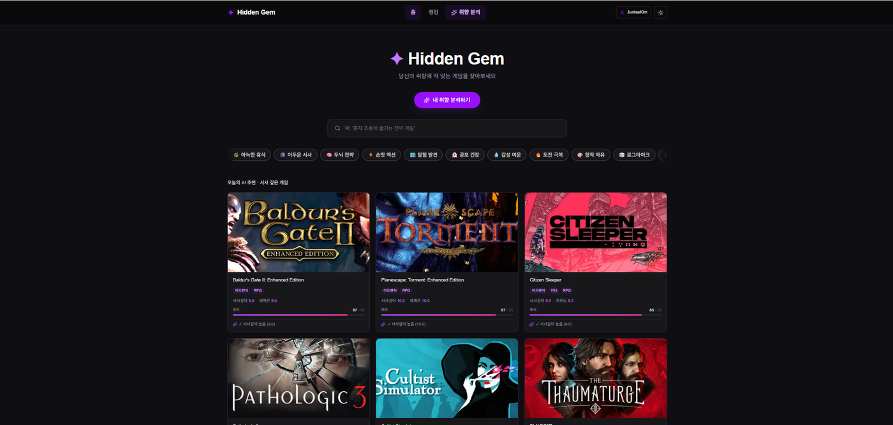
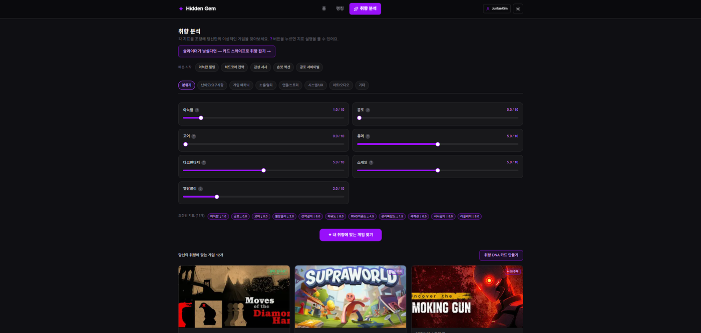
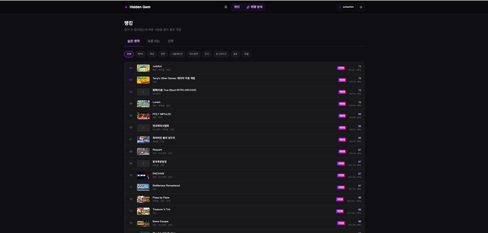
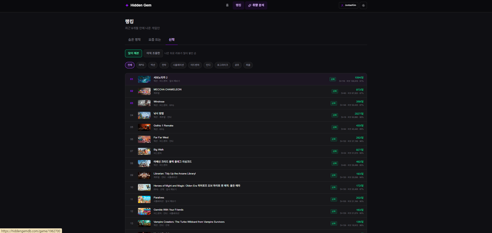
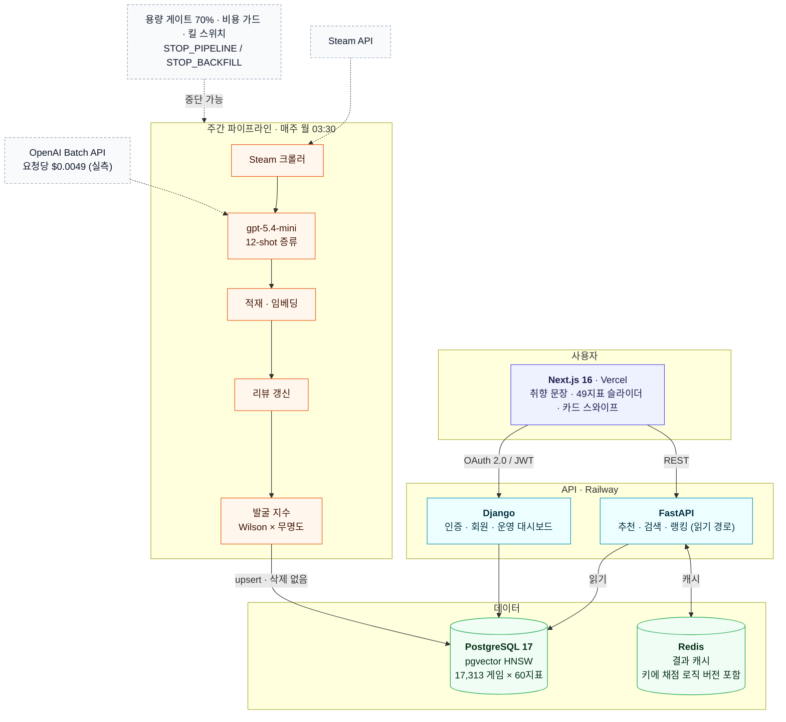
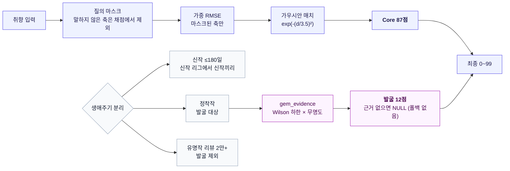

# Hidden Gem

Steam 게임 **17,313개**를 60개 지표로 정량화하고, 취향으로 게임을 찾고 숨은 명작을 발굴하는 서비스.

**Live**: [hiddengemdb.com](https://hiddengemdb.com) · **Web**: Next.js 16 (Vercel) · **API**: FastAPI + Django (Railway) · 2026-03~ 운영 중



## 개요

Steam에는 매년 1만 개 이상의 게임이 출시되지만, 발견은 인기 순위에 편중되고
장르 태그는 "이 게임이 왜 좋았는지"를 설명하지 못한다. Hidden Gem은 게임을
분위기·조작 요구도·메커니즘 같은 경험 단위의 지표로 분해해, 취향으로 게임을
찾을 수 있게 만든 프로젝트다.

- 게임당 60개 지표: 수치 49개(7개 그룹) + 불리언 태그 9개 + 신뢰도. 발굴 지수는 LLM 추정이 아닌
  **Steam 리뷰 실측**(Wilson 하한 × 무명도)
- 자연어 검색("혼자 조용히 즐기는 전략 게임"), 지표 슬라이더, 카드 스와이프의
  세 가지 취향 입력 방식 + 랭킹 3종(숨은 명작 / 요즘 뜨는 / 신작)
- 신작·정착·유명 게임을 한 척도에 놓지 않는다: 취향 일치는 같은 척도, 발굴·랭킹은 생애주기별로 다른 질문
- 신작은 매주 자동 수집·분석·리뷰 갱신되어 데이터셋이 계속 성장 (교사 4,190 + 학생 13,123 · 2026-03-16~ 출시작 전 구간 백필 완료)

기획부터 데이터 구축, 백엔드/프론트엔드, 배포, 운영까지 1인 개발.

**제품 원칙** — 근거가 없으면 점수를 주지 않는다(폴백 없음) · 신작과 정착작을 같은 척도에 올리지 않는다 ·
사용자가 건드리지 않은 축은 순위에 개입하지 않는다 · 화면에 내부 용어를 쓰지 않는다 · 약점을 화면에서 감추지 않는다.
핵심 지표는 하나다 — **추천 결과가 유명작으로 쏠리면 기능이 다 돌아도 제품은 실패한 것이다.**
→ [docs/product_overview.md](./docs/product_overview.md) : 문제 정의, 타깃, 측정 지표, **만들지 않은 것 6건과 그 이유**

> **공개 범위와 권리.** 이 저장소는 열람·평가 목적으로 공개한다. 코드·문서의 저작권은 저자에게 있으며
> 별도 라이선스를 부여하지 않는다(복제·재배포·상업적 이용 불허). 다음은 저장소에 포함하지 않는다 —
> 60지표 데이터셋과 운영 DB, **지표 분석 프롬프트·few-shot 예시**(데이터셋 재현 레시피), PRD·사업 계획.
> 지표 이름과 채점 공식은 코드와 문서에 있다. 필요 시 요청하면 범위를 정해 공유한다.

## 화면

세 가지 취향 입력(문장 · 슬라이더 · 카드)과 생애주기별 랭킹 3종이 실제로 어떻게 보이는지.
직접 만져보는 편이 빠르다 — [hiddengemdb.com](https://hiddengemdb.com)

**취향 분석 — 49개 지표 슬라이더**



7개 그룹(분위기 · 난이도/요구사항 · 게임 메커닉 · 소셜/멀티 · 연출/스토리 · 시스템/UX · 아트/오디오)으로
접어 둔 지표를 원하는 만큼만 조정한다. 하단의 **조정된 지표** 칩이 지금 무엇을 요구하고 있는지 보여준다 —
`아늑함 ↓1.0` `전략깊이 ↑8.0` 처럼. 건드리지 않은 지표는 채점에서 **가중치 0**(질의 마스크)이라
"관심 없는 축이 순위를 흔드는" 문제가 없다. 슬라이더가 부담스러운 사용자에겐 카드 스와이프 입력으로 보낸다.

**랭킹 · 숨은 명작 — 발굴 지수 순**



"많이 안 알려졌는데 해본 사람들 평이 좋은 게임". 정렬 기준은 LLM 추정이 아니라
**Steam 리뷰 실측** — 긍정률의 Wilson 하한(z=1.96) × 무명도(로그 스케일). 리뷰 82건에 100% 같은
표본이 상위에 오는 것은 이 공식의 의도된 동작이지만, 처음 보는 사용자에게 설득력이 약한 지점이기도 하다
(리뷰 하한 조정은 절제 실험 대기 중 — `docs/ablation_result_0905.md`).

**랭킹 · 신작 — 최근 6개월, 하루당 리뷰 누적 속도**



출시 180일 이내 게임만. `많이 해본` / `아직 조용한` 두 범위를 나눠 두었다 —
전자는 검증이 쌓인 신작, 후자는 리뷰 100건 미만이라 학생 모델 분석만 있는 게임이다.
신작을 정착작과 **같은 척도에 올리지 않는 것**이 이 프로젝트의 설계 결정 중 하나다
(발굴 지수는 정착작에만 부여, 근거 없으면 NULL · 폴백 없음).

## 아키텍처



**역할 분리** — FastAPI 는 추천·검색 읽기 경로(SQLAlchemy async), Django 는 인증·회원·데이터 관리(ORM/Admin)를 담당한다.
두 프레임워크가 같은 PostgreSQL 을 공유하며, **스키마 정본은 SQLAlchemy 모델로 고정**해 이중 ORM 의 드리프트를 막았다.
데이터는 어떤 경로로도 삭제하지 않는다 — 노출 제외는 `is_active` 플래그로만 한다.

### 점수가 만들어지는 경로

취향 입력은 고정된 "좋은 게임 순위"를 부르지 않는다. **말한 축만 채점하고, 발굴은 별도 항으로 분리**한다.



절제(ablation) 실측으로 확인한 것 — 이전 버전의 X-Factor 항은 질의와 무관하게 유명작을 끌어올리고 있었다
(단독 정렬 시 상위 20 의 리뷰 중앙값 19,700). v7 에서 게이트로 격하했고, 전환 후 취향 상위 10 에서 유명작은 0건이 됐다.

## 데이터: 교사-학생 증류 파이프라인

핵심 비용 문제 — 상위 모델로 전체를 분석하면 정확하지만 비싸고, 경량 모델은
싸지만 점수가 뭉개진다. 이를 지식 증류로 풀었다.

**교사 데이터 (1회 구축)**
- GPT-5.4 Batch API로 4,190개 게임 분석 (Batch 채택으로 동기 대비 비용 50% 절감)
- 블라인드 입력: 모델에는 `app_id, name, genres, description` 4개 필드만 제공.
  개발사·평점을 의도적으로 숨겨 인지도 편향을 차단

**학생 데이터 (13,123개, 2026-03-16~ 출시작 전 구간 백필 완료 + 매주 자동)**
- gpt-5.4-mini + 12-shot 증류로 교사와 동일한 스키마 유지. 실측 단가 요청당 $0.0049
  (Batch 50% × 프롬프트 캐시 90% 중복 적용, 대시보드 검증) — 회차 500건당 $2.45, 누적 약 $60
- 홀드아웃 150쌍(교사 게임을 학생이 재분석) — 49 수치 지표 평균 MAE 0.77 로 교사급.
  LLM 이 추정한 발굴 가능성(gem)은 교사와 상관이 없어(r≈0) **리뷰 실측 지수로 대체**
- few-shot 예시는 gem 점수 구간별 층화 추출: 명작만 예시로 주면 신작 점수가
  일괄 상향/하향되는 캘리브레이션 붕괴가 실측으로 확인되어, 하/중/상 구간과
  장르 다양성을 강제했다
- 품질 게이트: 적재 전 파싱률·스키마 완전성·gem 분포·confidence 분산을 검증.
  개별 출력이 그럴듯해도 집단 분포가 교사와 어긋나면 적재를 차단

**주간 자동화** (`embeddings/weekly_pipeline.py`)

```
space(볼륨 70% 게이트) → crawl(신작 발견, DB 중복 제외) → batch(few-shot 분석) → load(UPSERT)
  → embed(임베딩) → reviews(Steam 리뷰 수 + 노출 게이트) → percentile → recheck(비활성 30일 재평가)
  → history(활성 게임 주간 리뷰 이력 → '요즘 뜨는' 재료) → gem(발굴 지수 재계산)
```
대상 DB 는 **운영**(Railway Postgres). 로컬 DB 는 개발 미러이고, 로컬→운영 이동은 `embeddings/prod_sync.py`(upsert, 삭제 없음)만 쓴다.

- 노출 게이트: 분석·임베딩은 전수로 수행하되, 서비스 노출(`is_active`)은
  리뷰 수가 기준(기본 10, Steam이 리뷰 점수를 표시하는 최소치) 이상인 게임만.
  기존 데이터가 인기순 샘플이었던 것과 달리 신작은 출시작 전수라 리뷰 0개
  무명작이 그대로 들어오기 때문. 데이터는 지우지 않고 리뷰가 붙으면 재활성화
  (`embeddings/exposure_policy.py`, `refresh_reviews.py`)
- 학생 모델 감사: 교사 데이터 게임을 층화 샘플해 학생 모델로 다시 분석하고
  같은 게임의 교사 vs 학생 값을 직접 비교(지표 MAE·상관, gem 스피어만·구간
  혼동표, confidence 분산). 회차별 분포 감시와 별개로 주기적 실행
  (`embeddings/audit_student.py`)

- Windows Task Scheduler 매주 월 03:30 실행(실행 제한 26h — OpenAI Batch 대기 감안), 단계 실패 시 Discord 알림 후 중단.
  이중 실행은 `data/pipeline.lock`(PID) 으로 차단하고, 자식 단계의 출력까지 `logs/weekly_pipeline.log` 에 남긴다
- Batch API 장애 대비 동기 폴백(`--sync`), 미완료 배치의 부분 결과 수거 도구,
  잔여분 재시도 CSV 생성기까지 부분 실패를 전제로 설계
- 크롤러는 429 응답 시 페이지 간격을 자동 상향하는 적응형 스로틀링, 백필 시
  출시일 기준 조기 종료로 불필요한 페이징 제거

## 추천 엔진 (score_v7 + 생애주기)

점수는 **사용자의 취향 입력(또는 검색 문장)에 따라 달라진다** — 모든 게임에 같은 척도. 세 경로:

```
A 취향/Vibe   사용자가 움직인 지표만 비교(질의 마스크) → 가중 RMSE(w = 1 + |목표−5|/5)
              → match = exp(−(d/3.5)²) × 87   + 발굴 지수 × 12  →  0~99
B 게임 기반    지표 유사도 60% + 임베딩 40%  → ×94 + 발굴 ×5
C 문장 검색    임베딩 85% + LLM 지표 힌트 15% → ×94 + 발굴 ×5   (pgvector HNSW, 힌트는 7일 캐시)
```

- **발굴 지수(gem)** = Steam 리뷰 실측 Wilson 하한 × 무명도. **정착 게임(출시 180일 초과, 리뷰 2만 미만)에만** 준다.
  신작은 시간이 없어서 무명이고 유명작은 이미 발견됐으므로 0 — 상위에 유명작이 올라오지 않는 이유
- **신작 리그**: 신작은 정착 게임과 발굴로 경쟁하지 않고 신작끼리 취향 매칭. 랭킹은 화면에서 **숨은 명작**(발굴 지수) /
  **요즘 뜨는**(30일 리뷰 증가) / **신작**(출시 180일 내 누적 리뷰, 평가 70%+, 하위 탭으로 '많이 해본'·'아직 조용한')
  으로 분리. 내부 용어(발굴 지수·정착 게임)는 화면 문구에서 걷어냈다 — 사용자는 그 단어를 모른다
- **동점 처리**: 원점수(raw)로 정렬, 정확 동점만 선호 문장 임베딩 코사인으로 가른다 (Vibe 칩처럼 2~3개 지표면 동점이 수백 개)
- **측정으로 결정**: 전체 풀 절제(ablation)·스냅샷 diff 로 예측을 먼저 적고 실측으로 맞췄다. v6 의 X-Factor(18점)는
  상수가 아니라 유명작 통로였고(전체 풀 89% 가 15.6 미만), Core 의 장르 핵심 목표값이 상수 5.0 이었던 결함(D-26)은
  문서 검토 넷이 놓치고 소스를 읽어서 찾았다 → `docs/final_verdict_0905.md`, `docs/ablation_result_0905.md`
- 응답에 `score_breakdown`(core·gem·distance·fields_compared)·`lifecycle`·`gem_evidence` 를 포함해 설명 가능
- **백필 후 회귀 확인(s8, 2026-09-07)**: 모수가 12,843 → 17,313 으로 늘었는데 취향 10 시나리오는 상위 10 이
  전부 유지되고 점수 변화 0.00 이었다 — 신규가 전부 `too_new` 라 발굴 모수가 불변이므로 **바뀌면 그게 버그**다.
  신작 리그 1위는 메챠 카멜레온 → 서브노티카 2 로 교체(누적 리뷰 8.7만 → 12.7만)됐고, 이는 R-17 정렬이
  정상 작동한 결과라 카나리아 기준을 새 1위로 갱신했다. `요즘 뜨는`은 0건 — 리뷰 이력의 **두 시점 스냅샷**이
  아직 없어 30일 Δ 를 계산할 수 없다(행이 아니라 시간 간격이 없는 것). 주간 실행이 쌓으면 4~5주 뒤 살아난다

## 주요 기능

| 기능 | 설명 |
|---|---|
| 시맨틱 검색 | 자연어 문장을 의도/지표로 해석해 추천. URL 기반이라 결과 공유 가능 |
| 취향 분석 | 49개 지표 슬라이더 (카테고리·툴팁), 결과는 취향 DNA 카드로 저장/공유 |
| 카드 스와이프 온보딩 | 게임 12개 평가로 초기 취향 산출, 신규 API 없이 추천 응답의 지표 재활용 |
| Vibe 탐색 | 12개 분위기 칩 원클릭 추천 |
| 랭킹 | 숨은 명작(발굴 지수·뱃지) / 요즘 뜨는 / 신작(많이 해본·아직 조용한), 장르 필터 |
| 신작 섹션 | 취향 결과 아래 신작끼리 매칭한 별도 섹션 — 정착작과 같은 척도에 올리지 않는다 |
| 소셜 로그인 | Google OAuth2, Steam OpenID (allauth + JWT 회전/블랙리스트) |
| Steam 라이브러리 | 연동 시 보유 게임 플레이타임 상위를 분석해 유사 게임 진입점 제공 |

화면 캡처는 위 [화면](#화면) 절에 있다.

<!-- 캡처 추가: 카드 스와이프 온보딩, 취향 DNA 카드 -->

## 기술적 의사결정

- **협업 필터링 대신 콘텐츠 기반**: 신규 서비스의 콜드스타트와 인디 게임
  롱테일 특성상 행동 데이터 없이도 동작해야 했다. 행동 로그(UserAction) 수집
  인프라는 가동 중이며, 데이터가 쌓이면 개인화 레이어를 결합할 계획
- **JWT를 URL fragment로 전달**: OAuth 콜백에서 토큰을 쿼리스트링 대신
  fragment로 넘겨 서버 로그/Referer/히스토리 노출을 차단
- **Steam 로그인의 무이메일 처리**: Steam OpenID는 이메일을 제공하지 않아
  합성 이메일로 자동 가입을 통과시키고 닉네임은 프로필명을 사용
- **Steam 라이브러리는 무상태 조회**: DB 컬럼 추가 대신 호출 시 Steam API를
  직접 조회. v1 트래픽에서 마이그레이션 리스크를 지지 않는 선택
- **회원 탈퇴는 익명화**: 개인 식별 정보는 삭제하되 행동 로그/설문은
  SET_NULL로 보존 (PIPA/GDPR 삭제권 대응과 통계 가치의 양립)
- **비용 가드**: OpenAI 사용액이 시간/일 임계값을 넘으면 신규 호출을 자동
  차단하고 Discord로 알림. 1인 운영에서 비용 사고를 구조적으로 방지
- **파생 지표는 원본 행이 아니라 시간 간격을 요구한다**: 백필로 리뷰 이력을 17,556행 채워도 같은 게임의
  두 시점 스냅샷이 없으면 증가율 지표는 계산되지 않는다. 같은 종류의 지표를 새로 만들 때는
  "몇 시점이 필요한가"를 먼저 적는다
- **관리형 플랫폼의 참조 변수는 값 갱신과 프로세스 반영이 다른 사건이다**: Railway 의
  `${{Postgres.PGPASSWORD}}` 는 값이 바뀌어도 돌고 있는 컨테이너의 환경변수는 옛 값이다.
  비밀 교체 절차의 마지막 단계는 항상 **의존 서비스 재배포 + DB 를 실제로 읽는 엔드포인트로 확인**
- **파이프라인 이중 실행 차단**: 백필과 주간 실행이 겹쳐 같은 Steam API·DB 를 동시에 두드린 적이 있어
  `data/pipeline.lock` 에 PID 를 기록한다. 비정상 종료로 남은 잔해는 이어받는다

## 운영

- 캐싱: Redis TTL 계층(1h/30m), Rate Limiting(slowapi), Sentry 에러 추적
- 백업: 매일 pg_dump + 7일 로테이션, 주간 백업 무결성 자동 검증
  (gzip 검사 → pg_restore 구조 확인 → 테이블 수 검증 → Discord 보고)
- 장애 대응: 시나리오별 복구 절차 문서화(DRP), 분기 1회 복구 리허설
- 분석: 셀프호스팅 Umami (쿠키 동의 연동, 커스텀 이벤트로 퍼널 측정)
- 운영 하드닝: DEBUG 기본 False, SECRET_KEY 미설정 시 기동 거부, 운영에서 API 문서 비노출,
  `/ops/*` 는 `X-Ops-Token` 필수 — **토큰 미설정 시 운영에서는 503 으로 막는다(fail closed)**
- 헬스체크는 실제로 두드린다: `/health` 가 DB `SELECT 1` + Redis `PING` 을 수행하고 `components` 로
  사유까지 돌려준다. 정적 `{"status":"healthy"}` 였을 때 DB 비밀번호 교체 후 랭킹이 전부 500 이던 것도,
  Redis 인증 실패로 캐시가 죽어 있던 것도 잡히지 않았다 — 무엇을 확인하는지 모르는 헬스체크는 증거가 아니다
- 운영 대시보드: Django `/admin/dashboard/` 에서 방문(세션 기준)·행동·회원·데이터 현황을 한 화면에서 본다
- 운영 DB 정합: 게임 데이터는 로컬이 원본 → `prod_sync` 로 upsert(삭제 없음), 사용자 데이터는 운영이 원본.
  대량 쓰기 전 `db_space` 로 용량 확인(70% 게이트)

## 로컬 실행

```bash
cp .env.example .env        # 키 채우기: OPENAI_API_KEY, STEAM_API_KEY, GOOGLE_*, OPS_TOKEN
docker compose up -d        # db, redis, django, fastapi, batch, umami
docker exec hidden_gem_django python scripts/setup_oauth.py   # 소셜 로그인 등록

cd frontend
npm install && npm run dev  # http://localhost:3000
```

| 서비스 | 포트 | 역할 |
|---|---|---|
| fastapi | 8000 | 추천/검색 API |
| django | 8001 | 인증/회원/Admin |
| batch | - | 데이터 파이프라인 워커 (`docker compose exec batch ...`) |
| umami | 3001 | 셀프호스팅 분석 |

운영 상태 확인:

```bash
curl -s http://localhost:8000/health                                   # db·redis 를 실제로 두드린다
docker compose exec batch python -m embeddings.pipeline_status         # 파이프라인 현황(단계·경과·오늘 등록)
```

테스트:

```bash
.venv/Scripts/pytest fastapi_app/tests/test_score_invariants.py fastapi_app/tests/test_lifecycle.py -q   # 36 passed — 채점 불변식·생애주기·랭킹
docker compose exec batch python -m embeddings.rec_snapshot --save s8 ; ... --diff s7_rank_qa s8         # 추천 결과 회귀(19 시나리오)
docker compose exec fastapi python -m scripts.ablation --pool default                                    # 전체 풀 절제 실측
```

## 프로젝트 구조 (폴더마다 README 가 있다)

```
CLAUDE.md             작업 규칙 = 실수 대장 — 사고마다 원인 확정 후 규칙 한 줄. 새 환경 세팅·AI 협업 세션이 먼저 읽는다
fastapi_app/          추천·검색·랭킹 API              → fastapi_app/README.md
  services/score_v7.py       현재 채점기 (질의 마스크 + 가중 RMSE + 발굴 12)
  services/lifecycle.py      new / established / famous, 입장 규칙 admit()
  services/evidence.py       Wilson 하한 × 무명도 (발굴 지수)
  services/recommender.py    세 경로 오케스트레이션, 캐시, 타이브레이크
  routers/ranking.py         랭킹 3종
  scripts/ablation.py        전체 풀 절제 실측
django_core/          인증/회원/Admin (allauth, simplejwt)    → django_core/README.md
frontend/             Next.js 16 (App Router)                → frontend/README.md
embeddings/           데이터 파이프라인 (batch 컨테이너)       → embeddings/README.md
  weekly_pipeline.py         주간 오케스트레이터 (대상: 운영 DB, 용량 게이트, 킬 스위치)
  steam_crawler.py · batch_generator.py · batch_processor.py · generate_embeddings.py
  refresh_reviews.py · exposure_policy.py · gem_evidence.py
  rec_snapshot.py            추천 결과 스냅샷/회귀 비교 (카나리아 포함)
  pipeline_status.py         돌고 있는 파이프라인 현황 (단계·경과·오늘 등록·로그 꼬리)
  prod_sync.py · db_space.py · migrate.py   운영 DB 정합·용량·마이그레이션
  audit_student.py · usage_report.py        품질 감사 · 비용 실측
scripts/              스케줄러·백업·이미지 (호스트에서 도는 것)   → scripts/README.md
docs/                 결정(R-1~R-22)·실측·불변식(C-1~C-14)·포트폴리오 원재료 → docs/README.md
data/                 배치 산출물·스냅샷·홀드아웃 (gitignore)      → data/README.md
legacy/               은퇴한 코드·산출물 (참고용, 미실행)          → legacy/README.md
(비공개)              PRD·사업 계획·분석 프롬프트·few-shot 은 저장소 밖에서 관리한다 — 아래 '공개 범위' 참조
```

## 문서

- [docs/product_overview.md](./docs/product_overview.md) — **제품 개요 한 장** (문제·가설·타깃·제품 원칙·측정 지표·만들지 않은 것)
- [docs/security_review.md](./docs/security_review.md) — 보안 점검 기록
- [docs/apply_guide.md](./docs/apply_guide.md) — 배포/운영 절차
- [CLAUDE.md](./CLAUDE.md) — 작업 규칙(실수 대장). 이 프로젝트에서 낸 사고와 그로부터 나온 규칙
- [docs/decisions_0905.md](./docs/decisions_0905.md) — 설계 결정 R-1~R-24 (상황·검토·판단·근거)
- [docs/system_invariants.md](./docs/system_invariants.md) — 불변식 C-1~C-16 + 변경 전 체크리스트
- [docs/ablation_result_0905.md](./docs/ablation_result_0905.md) — 절제·스냅샷 실측 (예측을 먼저 적고 틀린 것도 남겼다)
- [docs/domain_setup_hiddengemdb.md](./docs/domain_setup_hiddengemdb.md) — 도메인 전환 체크리스트
