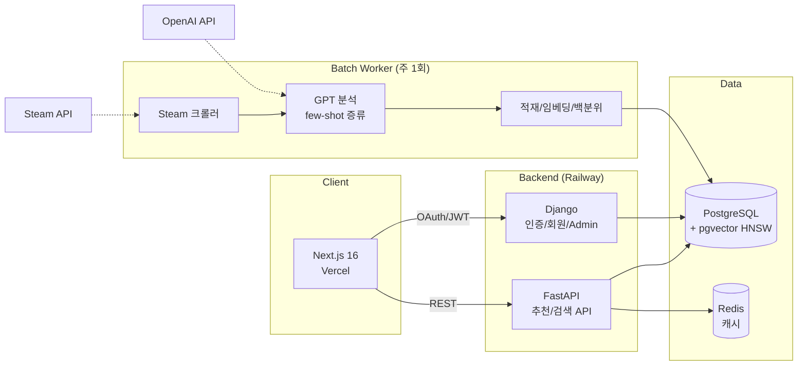

# Hidden Gem

Steam 게임 4,000여 개를 60개 지표로 정량화하고, 취향 기반으로 숨은 명작을 추천하는 서비스.

**Live**: [hidden-gem-gold.vercel.app](https://hidden-gem-gold.vercel.app) · **API**: FastAPI + Django (Railway) · **Web**: Next.js (Vercel)

<!-- docs/images/main.png : 메인 페이지 스크린샷 -->

## 개요

Steam에는 매년 1만 개 이상의 게임이 출시되지만, 발견은 인기 순위에 편중되고
장르 태그는 "이 게임이 왜 좋았는지"를 설명하지 못한다. Hidden Gem은 게임을
분위기·조작 요구도·메커니즘 같은 경험 단위의 지표로 분해해, 취향으로 게임을
찾을 수 있게 만든 프로젝트다.

- 게임당 60개 지표: 수치 49개(7개 그룹) + 불리언 태그 9개 + 발굴 가능성(gem)/신뢰도
- 자연어 검색("혼자 조용히 즐기는 전략 게임"), 지표 슬라이더, 카드 스와이프의
  세 가지 취향 입력 방식
- 신작은 매주 자동 수집·분석되어 데이터셋이 계속 성장

기획부터 데이터 구축, 백엔드/프론트엔드, 배포, 운영까지 1인 개발.

## 아키텍처



역할 분리: FastAPI는 추천·검색 읽기 경로(SQLAlchemy async), Django는
인증·회원·데이터 관리(ORM/Admin)를 담당한다. 두 프레임워크가 같은 PostgreSQL을
공유하며, 스키마 정본은 SQLAlchemy 모델로 고정해 이중 ORM의 드리프트를 막았다.

## 데이터: 교사-학생 증류 파이프라인

핵심 비용 문제 — 상위 모델로 전체를 분석하면 정확하지만 비싸고, 경량 모델은
싸지만 점수가 뭉개진다. 이를 지식 증류로 풀었다.

**교사 데이터 (1회 구축)**
- GPT-5.4 Batch API로 4,190개 게임 분석 (Batch 채택으로 동기 대비 비용 50% 절감)
- 블라인드 입력: 모델에는 `app_id, name, genres, description` 4개 필드만 제공.
  개발사·평점을 의도적으로 숨겨 인지도 편향을 차단

**신작 확장 (매주 자동)**
- 경량 모델 + few-shot 증류로 교사와 동일한 스키마 유지, 게임당 비용 수 원 수준
- few-shot 예시는 gem 점수 구간별 층화 추출: 명작만 예시로 주면 신작 점수가
  일괄 상향/하향되는 캘리브레이션 붕괴가 실측으로 확인되어, 하/중/상 구간과
  장르 다양성을 강제했다
- 품질 게이트: 적재 전 파싱률·스키마 완전성·gem 분포·confidence 분산을 검증.
  개별 출력이 그럴듯해도 집단 분포가 교사와 어긋나면 적재를 차단

**주간 자동화** (`embeddings/weekly_pipeline.py`)

```
crawl(신작 발견, DB 중복 제외) → batch(few-shot 분석) → load(UPSERT)
  → embed(임베딩 생성) → percentile(gem 백분위 전체 재계산)
```

- Windows Task Scheduler 주 1회 실행, 단계 실패 시 Discord 알림 후 중단
- Batch API 장애 대비 동기 폴백(`--sync`), 미완료 배치의 부분 결과 수거 도구,
  잔여분 재시도 CSV 생성기까지 부분 실패를 전제로 설계
- 크롤러는 429 응답 시 페이지 간격을 자동 상향하는 적응형 스로틀링, 백필 시
  출시일 기준 조기 종료로 불필요한 페이징 제거

## 추천 엔진 (score_v6)

두 종류의 유사도를 결합한 하이브리드 스코어링:

```
지표 유사도 (가중 유클리드 67% + 코사인 33%)     …… 60%
임베딩 유사도 (pgvector 1536-d, HNSW)            …… 40%
        ↓ sigmoid 정규화 → 0~94점
        + 히든젬 보너스 (최대 +5)  →  최종 0~99점
```

- **의도 기반 4단계 가중치**: 검색 의도에 따라 각 지표를
  Primary(5.0) / Secondary(2.0) / Neutral(0.5) / Irrelevant(0.1)로 분류.
  관련 지표와 무관 지표의 기여도를 약 7배 벌려 변별력을 확보
- **100점 앵커**: 기준 게임을 100점으로 두고 결과에서 제외, 나머지는 0~99
  절대 점수 — 점수 인플레이션과 "왜 만점이 없나" 혼란을 동시에 제거
- 배제 조건 파싱("공포 빼고" → 하드 필터), NULL 지표 3단계 폴백
- 응답에 score_breakdown과 추천 이유 문장을 포함해 결과를 설명 가능하게 유지

## 주요 기능

| 기능 | 설명 |
|---|---|
| 시맨틱 검색 | 자연어 문장을 의도/지표로 해석해 추천. URL 기반이라 결과 공유 가능 |
| 취향 분석 | 49개 지표 슬라이더 (카테고리·툴팁), 결과는 취향 DNA 카드로 저장/공유 |
| 카드 스와이프 온보딩 | 게임 12개 평가로 초기 취향 산출, 신규 API 없이 추천 응답의 지표 재활용 |
| Vibe 탐색 | 12개 분위기 칩 원클릭 추천 |
| 소셜 로그인 | Google OAuth2, Steam OpenID (allauth + JWT 회전/블랙리스트) |
| Steam 라이브러리 | 연동 시 보유 게임 플레이타임 상위를 분석해 유사 게임 진입점 제공 |

<!-- docs/images/search.png : 취향 분석 결과 화면 -->
<!-- docs/images/swipe.png : 스와이프 온보딩 -->
<!-- docs/images/dna.png : 취향 DNA 카드 -->

## 기술적 의사결정

- **협업 필터링 대신 콘텐츠 기반**: 신규 서비스의 콜드스타트와 인디 게임
  롱테일 특성상 행동 데이터 없이도 동작해야 했다. 행동 로그(UserAction) 수집
  인프라는 가동 중이며, 데이터가 쌓이면 개인화 레이어를 결합할 계획
- **JWT를 URL fragment로 전달**: OAuth 콜백에서 토큰을 쿼리스트링 대신
  fragment로 넘겨 서버 로그/Referer/히스토리 노출을 차단
- **Steam 로그인의 무이메일 처리**: Steam OpenID는 이메일을 제공하지 않아
  합성 이메일로 자동 가입을 통과시키고 닉네임은 프로필명을 사용
- **Steam 라이브러리는 무상태 조회**: DB 컬럼 추가 대신 호출 시 Steam API를
  직접 조회. v1 트래픽에서 마이그레이션 리스크를 지지 않는 선택
- **회원 탈퇴는 익명화**: 개인 식별 정보는 삭제하되 행동 로그/설문은
  SET_NULL로 보존 (PIPA/GDPR 삭제권 대응과 통계 가치의 양립)
- **비용 가드**: OpenAI 사용액이 시간/일 임계값을 넘으면 신규 호출을 자동
  차단하고 Discord로 알림. 1인 운영에서 비용 사고를 구조적으로 방지

## 운영

- 캐싱: Redis TTL 계층(1h/30m), Rate Limiting(slowapi), Sentry 에러 추적
- 백업: 매일 pg_dump + 7일 로테이션, 주간 백업 무결성 자동 검증
  (gzip 검사 → pg_restore 구조 확인 → 테이블 수 검증 → Discord 보고)
- 장애 대응: 시나리오별 복구 절차 문서화(DRP), 분기 1회 복구 리허설
- 분석: 셀프호스팅 Umami (쿠키 동의 연동, 커스텀 이벤트로 퍼널 측정)
- 운영 하드닝: DEBUG 기본 False, SECRET_KEY 미설정 시 기동 거부,
  운영에서 API 문서 비노출

## 로컬 실행

```bash
cp .env.example .env        # 키 채우기: OPENAI_API_KEY, STEAM_API_KEY, GOOGLE_*
docker compose up -d        # db, redis, django, fastapi, batch, umami
docker exec hidden_gem_django python scripts/setup_oauth.py   # 소셜 로그인 등록

cd frontend
npm install && npm run dev  # http://localhost:3000
```

| 서비스 | 포트 | 역할 |
|---|---|---|
| fastapi | 8000 | 추천/검색 API |
| django | 8001 | 인증/회원/Admin |
| batch | - | 데이터 파이프라인 워커 (`docker compose exec batch ...`) |
| umami | 3001 | 셀프호스팅 분석 |

테스트:

```bash
pytest fastapi_app/tests    # 추천 엔진/비용 가드 등 핵심 로직 24개
```

## 프로젝트 구조

```
fastapi_app/          추천 API (라우터/서비스/스코어링)
  services/score_v6.py       하이브리드 스코어링
  services/recommender.py    추천 오케스트레이션
  services/cost_guard.py     OpenAI 비용 자동 차단
django_core/          인증/회원/Admin (allauth, simplejwt)
frontend/             Next.js 16 (App Router)
embeddings/           데이터 파이프라인
  weekly_pipeline.py         주간 수집 오케스트레이터
  steam_crawler.py           신작 발견 (적응형 스로틀링)
  batch_generator.py         few-shot 배치 생성/제출
  batch_processor.py         결과 파싱/UPSERT
scripts/              백업/이미지/스케줄러 유틸
docs/                 설계 노트, 보안 점검, 운영 가이드
```

## 문서

- [PRD](./PRD_v4.2.3.md) — 제품 요구사항과 로드맵
- [docs/security_review.md](./docs/security_review.md) — 보안 점검 기록
- [docs/apply_guide.md](./docs/apply_guide.md) — 배포/운영 절차
