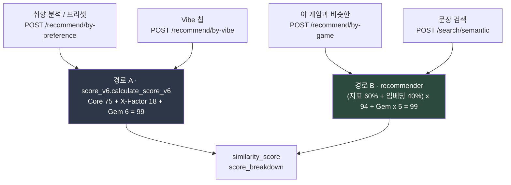
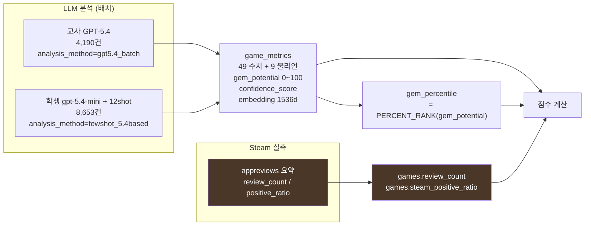
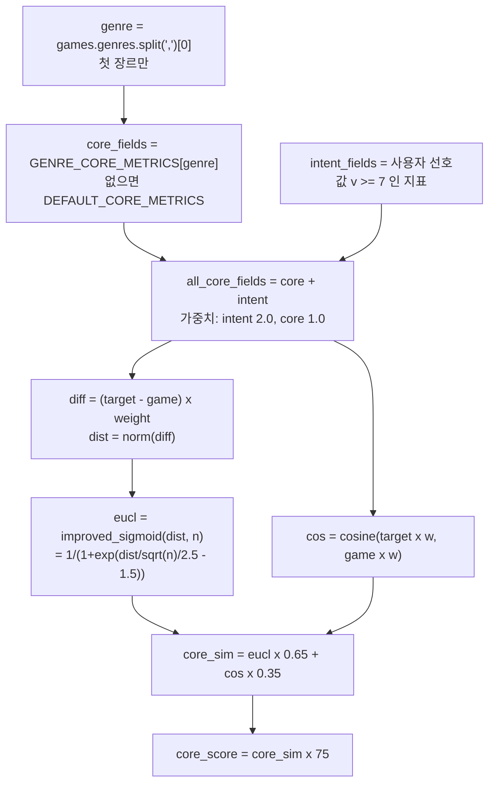
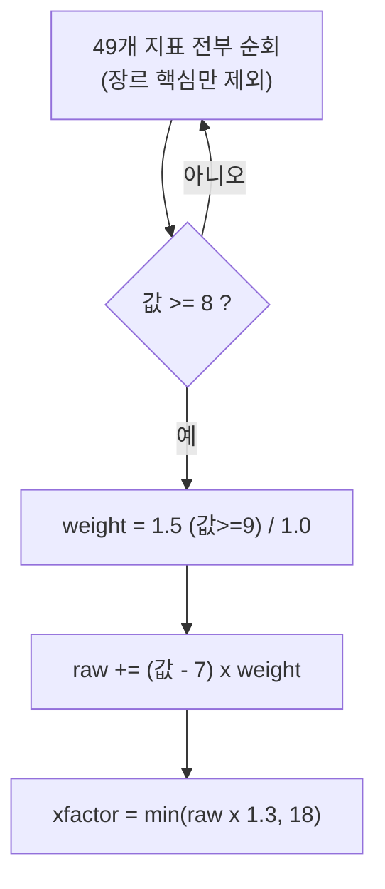
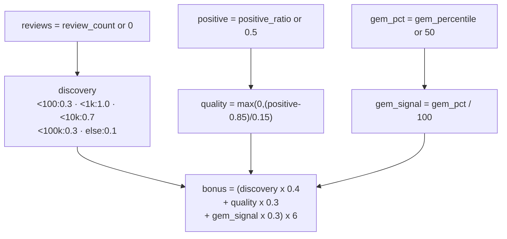
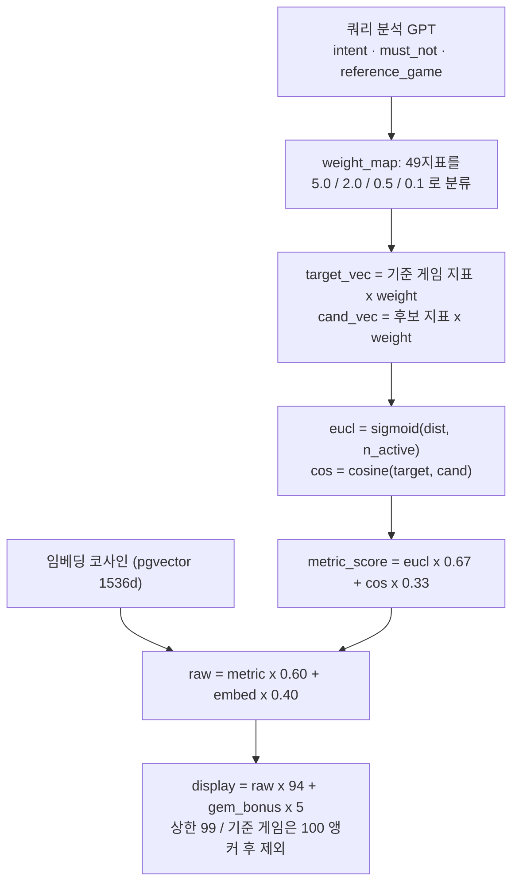
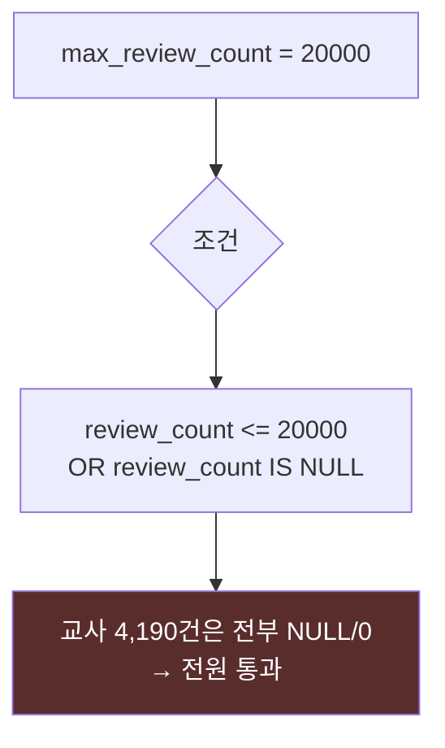
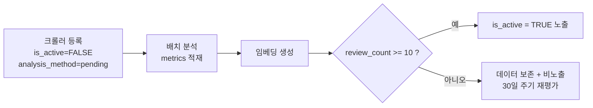

# 점수·지표 메커니즘 현황도 (as-is, 2026-09-04)

목적: **지금 코드에 실제로 구현된 것**을 그린다. PRD·README·포트폴리오의 설명이 아니라 소스 기준이다.
설계 의도와 어긋나는 지점은 `[D-n]` 으로 표시하고 12장에 모았다. 검토자는 12장부터 봐도 된다.

검토 기준 커밋: `d889517` / 파일 기준: `fastapi_app/services/score_v6.py`, `recommender.py`,
`routers/games.py`, `models/game.py`

---

## 1. 전체 구조 — 점수 경로가 **두 개**다

이게 이 시스템을 이해하는 첫 열쇠다. 엔드포인트에 따라 완전히 다른 공식이 돈다.



| | 경로 A (취향 분석) | 경로 B (유사 게임·문장 검색) |
|---|---|---|
| 점수 구성 | Core 75 + X-Factor 18 + Gem **6** | (지표 60% + 임베딩 40%) × 94 + Gem **5** |
| 지표 비교 대상 | 장르 핵심 + 의도 지표 **일부만** | 49개 **전부** |
| 가중치 | 하드코딩 `2.0 / 1.0` | 4단계 `5.0 / 2.0 / 0.5 / 0.1` |
| 임베딩 사용 | **안 함** | 40% |
| Gem 공식 | discovery + quality + gem_signal | gem × 0.7 + review_bonus, × confidence |
| 유명작 필터 | 인자 있음(A만) | 없음 |

→ 같은 게임이 두 화면에서 다른 논리로 채점된다. `[D-11]`

---

## 2. 데이터 계층 — 점수의 입력이 어디서 오는가



**현재 실측 상태** (중요 — 점수 해석이 여기서 갈린다)

| 데이터 | 교사 4,190건 | 학생 8,653건 |
|---|---|---|
| 49 수치 지표 | 원본(기준) | 교사 대비 평균 MAE **0.77** (0~10 스케일) = 교사급 |
| 그중 신뢰 불가 3개 | — | `modding_support` r=0.42 / `community_dependency` r=0.61 / `monetization_fairness` r=0.36 |
| `gem_potential` | 40~95 (μ75.5) | 1~92 (μ42.8) — **교사 스케일로 환산 불가**(MAE 19.5, ρ0.49) |
| `review_count` | **비어 있음(NULL/0)** | 조회 완료 8,653건(실패 0) |
| `steam_positive_ratio` | **비어 있음** | 조회 완료. 리뷰 1개 이상 6,947건 |
| `embedding` | 있음 | 있음 |

교사 코호트에 리뷰 실측이 없다는 사실이 `[D-3]` `[D-5]` `[D-6]` 을 동시에 유발한다.

---

## 3. 경로 A — Core (최대 75점)



핵심: **49개 전부를 비교하지 않는다.** 장르 핵심 2~3개 + 사용자가 7 이상으로 지정한 지표만 본다.
`[D-8]` 부정 선호(예: `horror_factor: 0`)는 `v >= 7` 조건에 안 걸려 **가중치 0** — 반영되지 않는다.
`[D-7]` `improved_sigmoid` 는 거리 0에서 `1/(1+e^-1.5) = 0.8176`. 독스트링의 "0.92"는 틀렸고,
그 결과 Core 실제 상한은 `(0.8176×0.65 + 1.0×0.35)×75 = 66.1`점 → **v6 최대 점수는 99가 아니라 90.1**.

## 4. 경로 A — X-Factor (최대 18점)



`[D-6]` **가중치 맵이 전혀 적용되지 않는다.** 사용자가 무엇을 원했는지와 무관하게 "8 이상이면 가점".
신뢰 불가 지표 `modding_support` 가 9면 `(9-7)×1.5×1.3 = +3.90점`, 3개 다 9면 **+11.70점** —
Gem 예산(6점) 전체보다 크다. 학생 코호트에서 이 3개는 신뢰 r 0.36~0.61.
`[D-9]` 사용자가 요청한 지표도 장르 핵심이 아니면 X-Factor에 다시 계상 → Core와 이중 가점.

## 5. 경로 A — Gem (최대 6점)



`[D-2]` `gem_percentile or 50` — **값이 0이면 50으로 읽힌다.** 근거 기반 지수로 전환하면
유명작을 0으로 만드는 게 핵심인데, 그 0이 중간값이 된다(의미가 정반대로 뒤집힘).
`[D-4]` `review_count` 가 NULL/0인 교사 게임은 `discovery = 0.3` 을 받는다. "리뷰가 없다"와
"리뷰가 0개다"를 구분하지 못한다.

## 6. 경로 A — 최종 합성

```
final = min(Core(≤66.1 실측) + X-Factor(≤18) + Gem(≤6), 99)
```

`[D-1]` **전제 확인(개발자 확답)**: 점수가 사용자의 취향/검색 문장에 따라 달라지는 것은 **의도한 설계**다.
그 의도 자체는 경로 A에서도 충족된다 — 사용자가 7 이상으로 지정한 지표가 `intent_fields` 로
Core에 동적으로 추가되고 가중치 2.0을 받는다.

어긋난 것은 **어떤 방식으로** 달라지느냐다. `recommend_by_preference` 는 4단계 `weight_map`
(5.0/2.0/0.5/0.1)과 `target_vec`·`cand_vec` 을 계산해 놓고 **점수에 쓰지 않는다**
(응답 echo·match_reason 정렬 전용). 실제 채점은 `calculate_score_v6` 이 자체 `2.0/1.0` 가중치로
**장르 핵심 + 의도 지표 부분집합만** 비교한다. 즉 두 개의 서로 다른 쿼리 의존 메커니즘이 있고,
문서·PRD가 설명하는 4단계 쪽은 이 경로에서 죽은 코드다.
→ 결정 필요: 4단계를 경로 A에 연결할지, 경로 A의 2.0/1.0 방식을 정식 설계로 확정하고
   문서를 그에 맞게 정정할지. **"쿼리 의존 채점이 잘못됐다"는 뜻이 아니다.**

**결정적 사실(외부 검토 지적, 소스 확인 완료)**: 경로 A에 필요한 올바른 코드가 **이미 존재하고
매 요청 실행되며 버려지고 있다.**
- `build_preference_vector`(`:425-440`)는 `preferences[field]` 를 그대로 타겟값으로 쓰고
  (즉 `horror_factor: 0` → 타겟 0), 미지정 지표는 `resolve_null(field, None)` 로 채운다
  → **D-8과 D-10이 동시에 해결되는 코드다.**
- `get_weight_map`(`:376-380`)은 `preferences` 에 있는 지표를 무조건 `W_PRIMARY(5.0)` 로 승격한다
  → 사용자가 말한 것이 지배하고, `W_NEUTRAL(0.5)` 이 "말 안 한 부분의 큰 어긋남"을 잡는다.
→ 통합은 대규모 리팩터링이 아니라 **이미 계산된 `target_vec`/`cand_vec` 을 점수에 연결하는 배선 작업**이다.

---

## 7. 경로 B — 유사 게임 / 문장 검색



Gem 보너스(경로 B):

```
gem = gem_percentile ?? gem_potential ?? 50
review_bonus = 0.3 x (1 - reviews/1000)   (reviews < 1000)
gem_bonus = min((gem/100 x 0.7 + review_bonus) x confidence, 1.0)   → x5 점
```

`[D-3]` `gem_percentile` 이 없으면 **`gem_potential`(LLM 원본)으로 폴백**한다. 두 값은 스케일이
다르고, 교사 게임은 리뷰가 NULL이라 `review_bonus` 최대(0.3)까지 받는다.
실측 비교: 교사(리뷰 NULL, gem 85, conf 0.9) → **4.03점** vs 진짜 무명 명작(리뷰 800, 지수 70,
conf 0.7) → **1.92점**. 근거 없는 쪽이 2.1배 높다.
`[D-12]` 가중치를 곱한 뒤 코사인을 계산한다. 모든 지표가 0~10 양수라 코사인이 0.95+에 몰려,
지표 유사도의 33%가 사실상 상수 오프셋이 된다.

---

## 8. 히든젬 정체성 필터 (`max_review_count`)



`[D-5]` NULL을 **명시적으로 통과**시키고 0도 통과한다. 교사 코호트에 리뷰 데이터가 없으므로
**이 필터는 한 번도 무엇도 걸러낸 적이 없다.** 실측 검증: 취향 프리셋 5개 전부
`전체` 와 `히든젬` 상위 10이 완전히 동일, 공포 1위가 FNAF3(gem_potential 93).
추가로 필터가 **by-preference 에만** 있다 — by-vibe는 인자를 넘기지 않고, by-game·semantic·
`/games/search` 에는 조건 자체가 없다.

## 9. 노출 게이트 (신작 전용, 최근 추가)



학생 라벨만 대상. 교사 4,190건은 게이트 범위 밖(항상 노출).

**게이트 적용 실측 (2026-09-04 13:49 완료, 3시간 19분 소요)**

| 리뷰 수 구간 | 게임 수 | 활성 |
|---|---|---|
| 0 | 1,706 | 0 |
| 1–2 | 1,701 | 0 |
| 3–9 | 2,033 | 0 |
| 10–49 | 1,813 | 1,794 |
| 50–199 | 829 | 823 |
| 200–999 | 384 | 380 |
| 1,000+ | 187 | 184 |
| **합계** | **8,653** | **3,181** |

비활성화 2,528건 / 활성화 1,594건 → 최종 노출 3,181건(37%).
**신작의 63%가 리뷰 9개 이하다.** 이 사실이 gem 설계에 직접 영향을 준다 — 근거 기반 지수는
리뷰가 있어야 계산되므로, 신작 5,440건은 구조적으로 히든젬 점수를 받을 수 없다.
가장 큰 활성 구간(10–49, 1,813건)은 무명도 하한 50 때문에 무명도가 모두 동일하고
Wilson 하한만으로 서열이 갈린다.

## 10. NULL·0 처리 요약 — 여기가 가장 위험하다

| 입력 | 경로 A 해석 | 경로 B 해석 |
|---|---|---|
| 지표 값 `0.0` | **`5.0`** `[D-10]` | weight_map 정책대로 |
| `gem_percentile = NULL` | `50` | `gem_potential` → 없으면 `50` |
| `gem_percentile = 0` | **`50`** `[D-2]` | `0` (정상) |
| `review_count` NULL/0 | `discovery = 0.3` | `review_bonus = 0.3` (최대) |
| `steam_positive_ratio` NULL | `0.5` → quality 0 | 미사용 |
| `confidence_score` NULL | 미사용 | `0.5` (보너스 반감) |

`[D-10]` `recommender.py:884` `float(getattr(game.metrics, f, 5.0) or 5.0)` — `0.0 or 5.0 == 5.0`.
지표 값 0은 흔하다: `horror_factor` 0이 학생 48%/교사 40%, `cozy_factor` 0이 35%/21%,
`stealth_importance` 0이 90%+. **이 값들이 전부 중립 5.0으로 바뀌어 취향 분석에 들어간다.**
"공포 원함(9)"에 공포 0 게임이 중간 점수를, "힐링 원함(공포 0)"에 공포 0인 완벽한 후보가
불이익을 받는다. 양방향으로 깨져 있다. 같은 파일 `:250-261` 의 `NULL_FALLBACK_POLICY` 가
지표별 폴백(공포·고어·모딩은 0, 나머지는 중앙값 등)을 이미 정의했는데 이 경로만 무시한다.

---

## 11. 값이 만들어져 화면까지 가는 전체 경로

```mermaid
flowchart LR
    S1["Steam 스토어 검색<br/>출시일 역순"] --> S2["appdetails<br/>name/genres/description"]
    S2 --> S3["games 등록<br/>pending, 비노출"]
    S3 --> S4["OpenAI Batch<br/>블라인드 4필드 입력"]
    S4 --> S5["game_metrics UPSERT<br/>49+9+gem_potential"]
    S5 --> S6["임베딩 1536d"]
    S6 --> S7["appreviews<br/>리뷰 수/긍정률"]
    S7 --> S8["노출 게이트"]
    S8 --> S9["gem_percentile 재계산"]
    S9 --> S10["추천 API<br/>경로 A / B"]
    S10 --> S11["프론트<br/>match_score · GemBadge(70/80/90)"]
```



`[D-13]` `GemBadge` 는 70/80/90 임계값을 쓴다. 근거 기반 지수로 전환하면 실측 최대가 약 72라
80·90 등급이 도달 불가가 된다.

---

## 12. 설계 의도와 어긋난 지점 — 검토 체크리스트

| # | 내용 | 위치 | 영향 |
|---|---|---|---|
| D-1 | 쿼리 의존 채점은 의도대로 동작하나, **문서가 설명하는 4단계 가중치**는 경로 A에서 미사용(죽은 코드). 실제로는 score_v6의 2.0/1.0 부분집합 비교가 돈다 | `recommender.py:846-899`, `score_v6.py:184-200` | 설계·문서 불일치 / 지표 강등이 get_weight_map만 고쳐선 무효 |
| D-2 | `gem_percentile or 50` → 값 0이 50으로 읽힘 | `score_v6.py:294`, `recommender.py:898` | gem 전환 의미가 반전 |
| D-3 | `gem_potential` 폴백으로 다른 스케일 혼입 | `recommender.py:560-563` | 근거 없는 게임이 진짜 히든젬보다 2.1배 보너스 |
| D-4a | 경로 B `review_bonus = 0.3 x (1 - reviews/1000)` — 리뷰 0이 **만점 0.3** | `recommender.py:566` | 리뷰 데이터 없는 교사 게임이 발굴 보너스 최대 수령 (치명) |
| D-4b | 경로 A `discovery` 계단 — 리뷰 <100은 **0.3(최저 티어)** | `score_v6.py:295-305` | 부당 수령 아님. 오히려 무리뷰 게임이 불리(리뷰 500개는 1.0). 다만 "리뷰 없음"과 "리뷰 0" 미구분은 남음 (경미) |
| D-5 | `max_review_count` 가 NULL을 통과시켜 무력 + 3개 경로에 미적용 | `recommender.py:858-862`, `routers/games.py:391` | 유명작 필터가 작동한 적 없음 |
| D-6 | X-Factor 18점이 **쿼리와 완전히 무관한 고정 가점**이다(신뢰 불가 지표 포함은 그 하위 문제). Core 실질 상한 66.1 대비 18점은 크고, LLM은 완성도 높은 인기작에 8~9를 광범위하게 준다 → 인기작에서 쉽게 포화 | `score_v6.py:232-246` | **치명**. 설계 의도 1(취향에 따라 달라짐)과 3(유명작 상위 금지)을 동시에 위반. 신뢰 불가 3개 제외는 필요조건일 뿐 |
| D-7 | sigmoid 독스트링 오류, 실제 최대 점수 90.1 (99 아님) | `score_v6.py:123-135` | 점수 상단이 도달 불가 |
| D-8 | 부정 선호(값 0)가 Core에서 무시됨 (`v >= 7` 조건) | `score_v6.py:172-175` | **치명**(미반영이 아니라 범주적 오답). D-10·D-6과 결합하면 "힐링, 공포 싫음" 쿼리에서 고완성도 공포게임이 진짜 코지게임과 몇 점 차로 붙는다 |
| D-9 | Core와 X-Factor가 사용자 요청 지표를 이중 계상 | `score_v6.py:232` | 요청 지표 과대평가 |
| D-10 | `or 5.0` 이 진짜 0.0을 5.0으로 만듦 | `recommender.py:884` | **취향 분석 정확도 직접 훼손** |
| D-11 | 두 경로의 Gem 예산 불일치 (6.0 vs ×5.0) | `score_v6.py:28`, `recommender.py:500` | 화면 간 점수 비교 불가 |
| D-12a | 경로 B: 49차원 양수 벡터 코사인 → 0.95+ 상수화 | `recommender.py:487` | 지표 유사도의 33%가 상수 오프셋 (높음) |
| D-12b | 경로 A: Core 코사인은 4~10차원 + intent 가중치 2.0 | `score_v6.py:200` | 상수화가 훨씬 약함 (낮음) |
| D-13 | 뱃지 임계 70/80/90이 새 지수 최대(≈72)와 불일치 | `frontend/src/lib/score.ts` | 상위 등급 도달 불가 |
| D-14 | 장르 Core가 **첫 장르만** 사용 | `recommender.py:887-890` | "인디, 전략" 게임이 인디로 분류 |
| D-15 | **경로 B도 상한 미달**: `weighted_euclidean_similarity` 가 거리 0에서 `1/(1+e^-1)=0.731`. 지표 상한 0.820 → 표시 최대 88.8. 독스트링은 "거리=0 → 1.0" 이라고 적혀 있다 | `recommender.py:449-459` | D-7과 대칭. 두 경로 모두 99에 못 닿음 (높음) |
| D-16 | **`analyze_query` 가 GPT에 주는 지표 목록이 `NUMERIC_METRIC_FIELDS[:20]`** — `narrative_depth`·`lore_richness`·`choice_consequence`·`visual_spectacle`·`replay_value`·`art_style_uniqueness` 등 29개가 빠져 있다. 그런데 **같은 프롬프트의 few-shot 예시가 `narrative_depth:9, lore_richness:9` 를 쓴다** | `recommender.py:969` | 프롬프트가 자기모순. 서사·스토리 계열 쿼리가 "GPT가 제약을 무시해주는 것"에 의존해 동작 중 (높음) |
| D-17 | `min_gem_potential` 필터가 두 경로 모두 LLM 원본 `gem_potential` 을 본다 | `recommender.py:874-877`, `:1073` | gem 전환 후 "사용 불가 판정된 값(근거 지수와 r=-0.022)"으로 걸러내는 모순 (높음) |
| D-18 | `compute_gem_bonus` 의 `quality = max(0,(positive-0.85)/0.15)` 에 상한 클램프 없음 | `score_v6.py:307` | 현재는 `steam_positive_ratio` 가 0~1 스케일이라 무해. 0~100 스케일 값이 유입되면 quality 수백 → 최종 `min(bonus, 6.0)` 에 걸려 **모든 게임이 gem 만점**. 잠재 결함, 방어 클램프 권장 (중간) |
| D-19 | `recommend_by_preference` 가 요청마다 활성 게임 전체를 selectinload 로 적재하고 파이썬에서 채점 (죽은 `cand_vec` 계산 포함) | `recommender.py:840-880` | 정확도 아님. 노출 게임 수에 비례해 지연 증가 (중간) |

### 검토자에게 부탁할 질문
0. **전제**: 점수가 취향/검색 문장에 따라 달라지는 것은 의도된 설계다(개발자 확답). 이를 부정하는
   방향의 제안은 필요 없다. 쟁점은 "그 쿼리 의존성을 어느 메커니즘으로 구현하느냐"다.
1. D-1: 4단계 가중치(5.0/2.0/0.5/0.1)를 경로 A에 연결할 것인가, 경로 A의 2.0/1.0 부분집합 방식을
   정식으로 확정하고 문서를 정정할 것인가? 두 방식의 장단을 지표 개수·변별력 관점에서 비교해줄 것.
2. D-10 수정 시 `NULL_FALLBACK_POLICY` 를 그대로 쓰면 되는가, 지표별 폴백값 자체도 재검토가 필요한가?
3. D-6: X-Factor에서 신뢰 불가 3개를 제외하는 것으로 충분한가, 아니면 가중치 개념을 도입해야 하는가?
4. D-2·D-3·D-4를 고치면 교사 4,190건의 gem 보너스가 대부분 0이 된다. 이 랭킹 이동을 감수할 것인가?
5. D-7·D-11: 점수 상한을 실제 도달 가능 범위로 재조정할 것인가, 공식을 바꿔 99에 닿게 할 것인가?

### 참고 문서
- `docs/code_review_0904.md` — 이번 리뷰 전문(파이프라인·도구 결함 포함)
- `docs/gem_transition_plan.md` — gem 근거 지수 전환 계획과 안전 절차
- `docs/backfill_runbook_0904.md` — 백필 후속 작업 순서·비용
